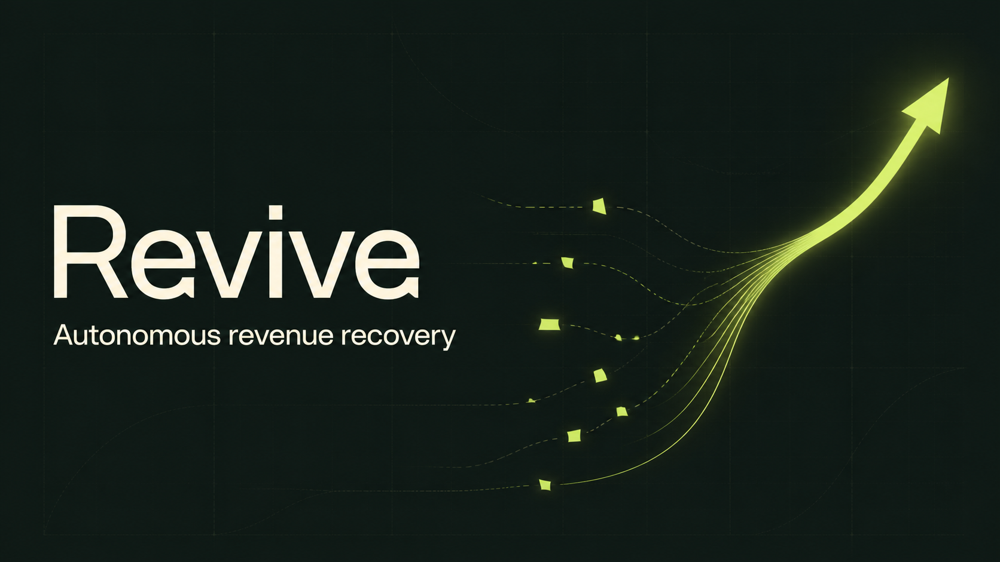
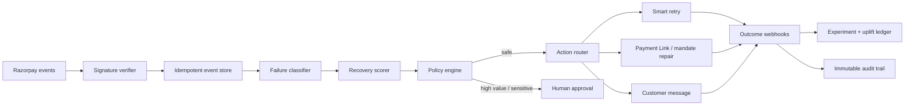

# Revive

**Autonomous revenue recovery for failed recurring payments.**

[](#why-this-problem)
[](#run-locally)
[](https://www.typescriptlang.org/)



## The pitch

Failed payments should not automatically become lost customers. Revive listens to recurring-payment failures, understands *why* each one failed, selects the safest high-probability recovery path, and proves how much revenue its actions actually added.

It is an agentic control plane designed around three promises:

1. **Recover intelligently.** Retry timing, payment rail, issuer health, customer value and failure semantics shape the next action.
2. **Protect customer trust.** Contact caps, quiet hours, consent, RBI-aware thresholds and human approval gates run before every action.
3. **Prove incrementality.** Stable holdouts distinguish revenue created by Revive from payments that would have recovered anyway.

This repository contains a polished interactive product, a working recovery decision engine, a simulated API, automated policy tests, researched architecture, submission copy, and a production-ready five-minute pitch-video prompt.

## Why this problem

Razorpay documents several recurring-payment failure causes: expired cards, bank blocks, insufficient balance and cancelled mandates. A failed subscription moves to `pending`; after retries are exhausted it moves to `halted`, and some later collections require manual intervention. Razorpay also notes that failed recurring payments can cost early-stage SaaS businesses up to 10% of revenue. ([payment retries](https://razorpay.com/docs/payments/subscriptions/payment-retries/?preferred-country=IN), [SaaS decision guide](https://razorpay.com/blog/payment-gateways-saas-startups-decision))

The infrastructure primitives already exist—failure events, error taxonomies, retries, hosted update flows and Payment Links. The unsolved product problem is coordinating those primitives at the merchant level with context, trust controls, explanations and causal measurement.

Revive is that coordination layer.

## Product tour

| Surface | What it demonstrates |
| --- | --- |
| Command center | Recovered revenue, incremental uplift, safe autonomy and a live agent activity feed |
| Recovery queue | Value- and probability-ranked cases across UPI AutoPay, cards and eMandate |
| Decision drawer | Evidence, model confidence, policy version, customer context and approval controls |
| Agent playbooks | Specialist event, reasoning, policy and action agents with bounded autonomy |
| Experiments | Treatment/holdout measurement, confidence and segment-level uplift |
| Audit trail | Immutable decision IDs, policy outcomes, confidence and proof hashes |
| Live demo | A four-stage failure-to-recovery simulation backed by a real local API route |

The dashboard uses realistic fictional data. No real customer data, credentials, charges or customer messages are used.

## Architecture



The checked-in decision engine implements failure-aware routing, UPI AutoPay AFA handling, contact/consent/value guardrails, safe scheduling, evidence generation and deterministic idempotency keys. See [the detailed architecture](docs/ARCHITECTURE.md).

## Decision contract

`POST /api/recovery/simulate`

```json
{
  "eventId": "evt_demo_4821",
  "customerId": "cust_demo_nisha",
  "amount": 11999,
  "failureReason": "insufficient_balance",
  "rail": "upi_autopay",
  "occurredAt": "2026-08-27T09:42:00.000Z",
  "contactsLast72Hours": 0,
  "hasMessagingConsent": true,
  "issuerHealthy": true,
  "lifetimeValue": 148200
}
```

The response returns the selected action, confidence, execution mode, schedule, policy checks, evidence and a stable idempotency key. In a production Razorpay integration, the event listener would verify the HMAC-SHA256 signature against the raw body and deduplicate on `x-razorpay-event-id`, as required by Razorpay's [webhook guidance](https://razorpay.com/docs/webhooks/validate-test/?preferred-country=IN).

## Trust and compliance by design

- Raw-body webhook signature verification before processing
- Duplicate and out-of-order event safety
- Consent and message-frequency enforcement
- Quiet-hour scheduling
- Human approval above configurable value thresholds
- UPI AutoPay authentication routing above the regular-industry ₹15,000 no-AFA limit
- No storage of card or UPI credentials
- Versioned policy result and evidence attached to every decision
- Kill switch and issuer-health holds before execution

Razorpay supports UPI AutoPay, cards and eMandate for subscriptions; each rail has distinct recovery mechanics. For regular-industry UPI AutoPay debits above ₹15,000, the customer must approve the transaction with a UPI PIN. ([supported methods](https://razorpay.com/docs/payments/subscriptions/supported-payment-methods/?preferred-country=IN), [UPI AutoPay](https://razorpay.com/docs/payments/payment-gateway/s2s-integration/recurring-payments/upi/))

## Run locally

Requirements: Node.js 22.13 or newer.

```bash
npm install
npm run dev
```

Open `http://localhost:3000` and select **Run live demo**.

Quality checks:

```bash
npm run lint
npm test
npm run build
```

The tests cover action selection, value gates, contact caps, issuer holds, UPI AFA routing and stable idempotency.

## Technology

- React 19 + Next.js-compatible App Router
- TypeScript decision engine and API route
- Vinext/Vite output for Cloudflare Workers
- Tailwind CSS pipeline plus a custom responsive design system
- Lucide icons
- Node test runner with `tsx`

## Production roadmap

1. Connect Razorpay test-mode subscription and payment webhooks.
2. Persist encrypted events, policy versions, experiments and outcomes.
3. Train per-merchant recovery propensities with conservative global priors.
4. Add Razorpay Payment Link and subscription update adapters.
5. Integrate consent-aware WhatsApp/email/SMS providers.
6. Launch in shadow mode, then graduate actions from approval to bounded autonomy.
7. Expose recovered-revenue attribution to finance and customer-success systems.

## Repository guide

- [`app/page.tsx`](app/page.tsx) — interactive product experience
- [`lib/recovery-engine.ts`](lib/recovery-engine.ts) — deterministic decision and policy engine
- [`app/api/recovery/simulate/route.ts`](app/api/recovery/simulate/route.ts) — simulation endpoint
- [`docs/RESEARCH.md`](docs/RESEARCH.md) — evidence and product thesis
- [`docs/ARCHITECTURE.md`](docs/ARCHITECTURE.md) — production system design
- [`docs/PITCH_PROMPT.md`](docs/PITCH_PROMPT.md) — detailed five-minute Obsidian pipeline prompt
- [`docs/SUBMISSION.md`](docs/SUBMISSION.md) — copy-ready buildathon form answers

## Acknowledgement

Built for the Razorpay AI Buildathon, Track 3: AI Revenue Recovery. Revive is an independent prototype and is not an official Razorpay product.
