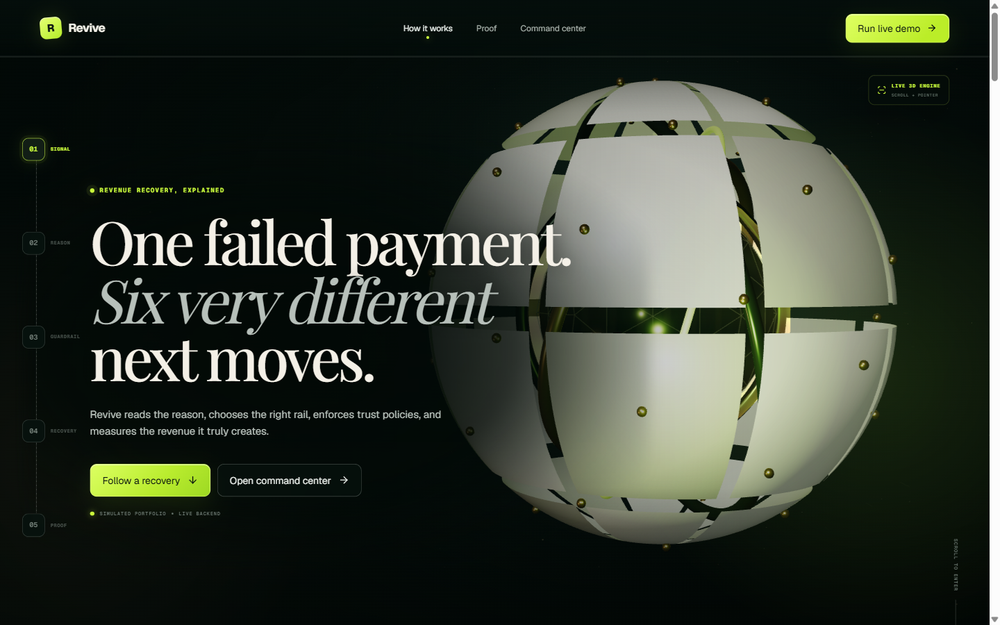
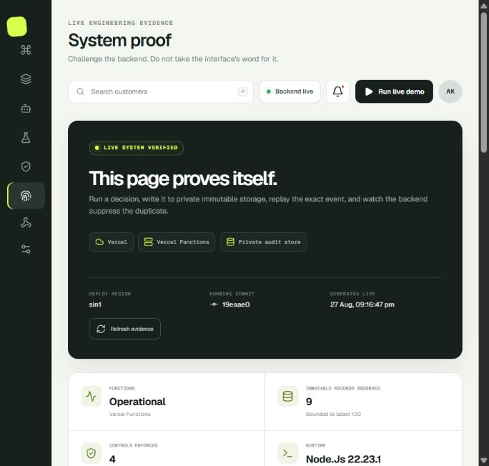
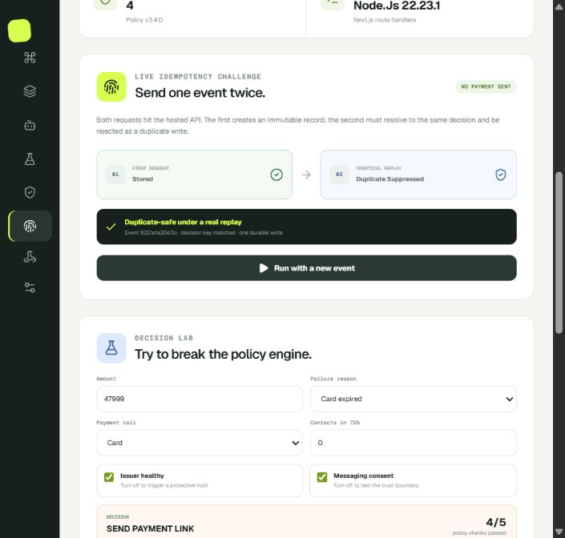
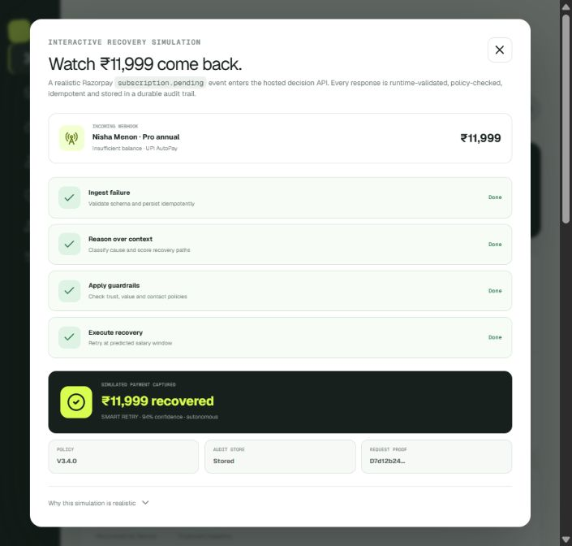
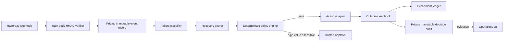
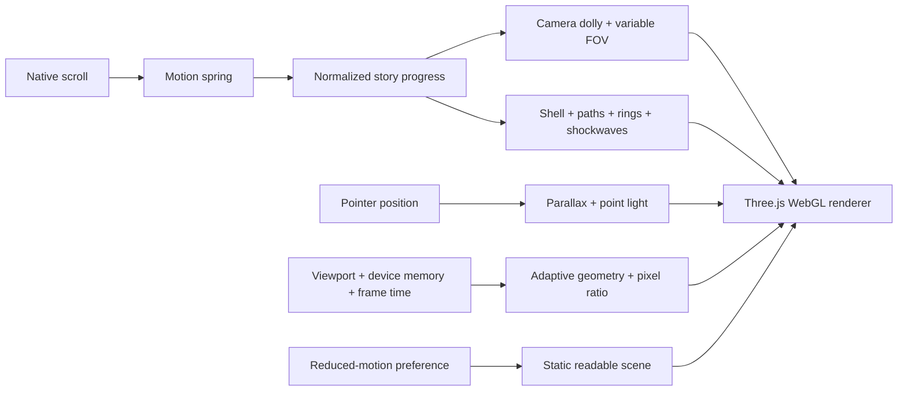

# Revive

**Autonomous revenue recovery for failed recurring payments.**

[](https://revive-revenue.vercel.app)
[](https://github.com/ReaperXD67/revive-ai/actions/workflows/ci.yml)
[](#engineering-evidence)
[](#engineering-evidence)
[](#engineering-evidence)
[](#a-recovery-you-can-enter)
[](LICENSE)

[](https://revive-revenue.vercel.app)

> [Open the public product](https://revive-revenue.vercel.app) · [Challenge the live backend](https://revive-revenue.vercel.app/api/proof) · [Check service health](https://revive-revenue.vercel.app/api/health) · [Read the API contract](docs/openapi.yaml) · [Use the five-minute pitch prompt](docs/PITCH_PROMPT.md)

## The one-minute pitch

A low balance, revoked UPI mandate, expired card, bank outage, authentication requirement, and network timeout are all “failed payments”—but they should not trigger the same recovery action.

Revive turns Razorpay subscription/payment failures into explainable recovery plans. It classifies the failure, selects a rail-aware next action, runs deterministic trust policies, persists an audit record, and measures incremental uplift against a holdout. Models can recommend; policies authorize.

The result is an operations product built around three promises:

1. **Recover intelligently.** Retry timing, payment rail, issuer health, customer value, and failure semantics shape the next action.
2. **Protect customer trust.** Consent, contact caps, IST quiet hours, UPI AutoPay thresholds, and high-value approval gates run before execution.
3. **Prove incrementality.** Stable holdouts distinguish revenue created by Revive from payments that would have recovered naturally.

This is an independent Razorpay AI Buildathon prototype for **Track 3: AI Revenue Recovery**.

## A recovery you can enter

The landing page is not a prerecorded render. It is a live Three.js scene driven continuously by native scroll position and pointer depth. One payment failure becomes a physical system: its shell dismantles, signal paths converge, policy rings align, and the engine rebuilds around recovered revenue.

| Story chapter | Live 3D behavior | Product meaning |
| --- | --- | --- |
| Signal | Thirty-two physical shell segments separate while six failure nodes and curved data paths appear | “Payment failed” is unpacked into distinct causes |
| Reason | The camera moves through the shell toward a shader-lit decision core while packets travel inward | Evidence is classified before an action is chosen |
| Guardrail | Concentric metallic rings align around the core | Deterministic trust policies bound autonomy |
| Recovery | The assembly resolves inward, the core intensifies, and layered shockwaves propagate | The selected rail produces a measurable outcome |
| Proof | Motion settles and hands the story to the interactive command center and live backend evidence | Every claim remains inspectable and replayable |

The scene uses a custom Fresnel/scan-line shader, Catmull–Rom signal tubes, moving energy packets, scroll-velocity depth streaks, variable-FOV camera choreography, pointer lighting, and additive energy layers. It progressively reduces geometry and pixel density on compact or lower-memory devices, avoids expensive full-frame post-processing, and presents a static readable state when `prefers-reduced-motion` is enabled.

## What is actually implemented

| Layer | Implemented proof |
| --- | --- |
| Product | Scroll-controlled cinematic WebGL story, responsive command center, ranked recovery queue, explainable case drawer, agent playbooks, experiment analysis, audit trail, live modal flow, System Proof, replay challenge, and interactive Decision Lab |
| Decision engine | Failure-aware action routing, confidence, approval/block modes, consent/contact/value/AFA gates, issuer holds, IST quiet-hour scheduling, evidence, and deterministic idempotency keys |
| Hosted API | Strict runtime schema validation, byte-size limits, safe errors, no-store responses, request proof IDs, a safe live evidence endpoint, and an OpenAPI 3.1 contract |
| Webhook boundary | Raw-body HMAC-SHA256 verification, secret fail-closed behavior, event-ID requirement, payload hash, and invalid-signature rejection |
| Persistence | Private Vercel Blob audit records, deterministic SHA-256 object paths, immutable writes, and storage-enforced duplicate suppression |
| Security | CSP, clickjacking/MIME/referrer/permissions/HSTS headers, no client secrets, bounded public work, dependency audit, and an explicit residual-risk register |
| Quality | 16 tests, 95.75% line coverage on the core tested modules, lint, production build, GitHub Actions, and Dependabot |
| Deployment | Public full-stack Vercel deployment; native Next.js frontend, route handlers, encrypted secrets, and private Blob storage are hosted together |

All customers, amounts, uplift metrics, and payment outcomes visible in the UI are realistic fictional demo data. The product does not initiate a real charge or send a real customer message.

## Recruiter demo path

Use this path to see the strongest engineering story in under 90 seconds:

1. Open the [live product](https://revive-revenue.vercel.app) and scroll slowly through **Signal → Reason → Guardrail → Recovery**. The 3D engine dismantles, moves the camera through the system, and reassembles around ₹11,999 recovered.
2. Select **Run live demo**, then **Start simulation**. The browser calls the hosted decision API; success is impossible unless a real response returns a valid plan.
3. From the success state, select **Inspect audit proof** to move directly into **System proof**.
4. Run **Prove duplicate safety**. Two identical production requests must resolve to `stored → duplicate_suppressed`, backed by one immutable private record.
5. In **Decision Lab**, try ₹47,999 to force approval, set two contacts to trigger a block, or disable issuer health to force a protective hold.
6. Return to the command center and scan revenue-at-risk, uplift, safe-autonomy, and live-agent activity.
7. Select **Review agent plan** and open a priority case to inspect evidence, confidence, policy version, context, and the human override.
8. Visit **Experiments** for treatment-versus-holdout measurement and **Audit trail** for explainability.
9. Open [`/api/proof`](https://revive-revenue.vercel.app/api/proof) to inspect the deployed commit, region, runtime controls, endpoint inventory, and bounded private-store evidence independently of the UI.

[](https://revive-revenue.vercel.app)





## Why this problem matters

Razorpay documents that failed subscriptions can move to `pending` and then `halted` after retries, with failure causes including expired cards, bank blocks, insufficient balance, and cancelled mandates. Its SaaS guidance also describes involuntary churn as a material revenue risk. The infrastructure primitives—events, reasons, retries, update flows, and Payment Links—already exist. The product gap is coordinating them with context, customer-trust controls, explanations, and causal measurement.

Primary research is summarized in [`docs/RESEARCH.md`](docs/RESEARCH.md), with direct links to Razorpay and RBI sources.

## Architecture



The checked-in slice implements the shaded center of this design: authenticated webhook ingestion, durable deduplication/audit, a deterministic plan, and the interactive proof flow. Real payment/message adapters, an outbox, and multi-tenant authorization remain explicit pilot blockers. See [`docs/ARCHITECTURE.md`](docs/ARCHITECTURE.md) and [`docs/ENGINEERING_AUDIT.md`](docs/ENGINEERING_AUDIT.md).

### Cinematic frontend architecture



The full scene is isolated in a client-only component, while the landing-page copy, navigation, and conversion controls remain semantic React UI. Scroll changes update mutable Three.js state directly rather than forcing React renders on every frame.

## Hosted API

| Endpoint | Purpose | Important behavior |
| --- | --- | --- |
| `GET /api/health` | Operational proof | Reports decision-engine and private-storage state; returns 503 when persistence is degraded |
| `GET /api/proof` | Safe system evidence | Reports deployed commit/region/runtime, enforced controls, API inventory, and bounded hashes/counts from private storage—never secrets or raw records |
| `POST /api/recovery/simulate` | Build a recovery plan | Strict JSON schema, 4 KiB limit, policy version, persistence state, proof ID |
| `POST /api/webhooks/razorpay` | Razorpay-shaped ingestion | Verifies HMAC on untouched bytes, requires event ID, caps 64 KiB, and suppresses duplicates with immutable object keys |

Example:

```bash
curl -X POST https://revive-revenue.vercel.app/api/recovery/simulate \
  -H "content-type: application/json" \
  -d '{
    "eventId": "evt_readme_001",
    "customerId": "cust_demo_nisha",
    "amount": 11999,
    "failureReason": "insufficient_balance",
    "rail": "upi_autopay",
    "contactsLast72Hours": 0,
    "hasMessagingConsent": true,
    "issuerHealthy": true,
    "lifetimeValue": 148200
  }'
```

The response contains `SMART_RETRY`, confidence, autonomous/approval/blocked mode, an IST-safe schedule, five policy results, evidence, a stable action key, database persistence state, and a request proof ID. The complete contract is in [`docs/openapi.yaml`](docs/openapi.yaml).

## Trust model

- Webhook data is hostile until the raw bytes pass HMAC verification.
- TypeScript types are not trusted as runtime validation.
- The model/action score never bypasses deterministic policy checks.
- Deterministic SHA-256 paths and immutable Blob writes—not process memory—enforce duplicate suppression across function instances.
- Contact, consent, issuer, AFA, and money gates can block or require human approval.
- API responses do not expose stacks, environment variables, secrets, or raw credentials.
- The browser cannot display a success result after an API error.
- No PAN, CVV, UPI PIN, card/mandate credential, or real customer PII is stored.

The public-demo verdict and remaining pilot blockers are documented in [`docs/ENGINEERING_AUDIT.md`](docs/ENGINEERING_AUDIT.md). A reusable red-team prompt is in [`docs/ENGINEERING_REVIEW_PROMPT.md`](docs/ENGINEERING_REVIEW_PROMPT.md).

## Engineering evidence

```text
16 tests passing
95.75% line coverage
91.23% branch coverage
100% function coverage
lint passing
production build passing
0 production dependency vulnerabilities
live health and system-proof checks: operational
live private Blob check: operational
invalid webhook signature: HTTP 401
runtime CSP / frame / MIME headers: verified
browser console warnings and errors in core demo: none
```

Run the same gate locally:

```bash
npm ci
npm run check
npm run test:coverage
npm audit --omit=dev
```

GitHub Actions runs the equivalent gate on pushes and pull requests. Dependency updates are monitored by Dependabot.

## Local development

Requirements: Node.js 22.13 or newer.

```bash
npm ci
npm run dev
```

Open `http://localhost:3000` and select **Run live demo** or **System proof**. To exercise persistence locally, link the project with `vercel link`, pull development variables with `vercel env pull`, and inspect `/api/health` and `/api/proof`.

## Deployment

**Production: [revive-revenue.vercel.app](https://revive-revenue.vercel.app).**

The repository now uses native Next.js 16 and is connected directly to the Vercel project. Production serves the interface and route handlers from one release, keeps webhook credentials in encrypted environment variables, and stores audit evidence as private immutable Blob objects in `sin1`. Pushes can produce deployment previews through the connected GitHub integration.

The exact deployment contract and verification evidence are in [`docs/DEPLOYMENT_DECISION.md`](docs/DEPLOYMENT_DECISION.md).

## Repository map

| Path | Responsibility |
| --- | --- |
| [`app/landing-page.tsx`](app/landing-page.tsx) | Semantic scroll narrative, chapter navigation, conversion actions, and motion-value orchestration |
| [`app/revenue-core.tsx`](app/revenue-core.tsx) | Live Three.js scene, custom shader, signal flow, camera choreography, adaptive rendering, and cleanup |
| [`app/landing.css`](app/landing.css) | Cinematic layout, typography, responsive composition, overlays, and reduced-motion treatment |
| [`app/page.tsx`](app/page.tsx) | Interactive recruiter/demo experience and truth-linked API success state |
| [`app/system-proof.tsx`](app/system-proof.tsx) | Live deployment evidence, duplicate replay challenge, and policy-boundary Decision Lab |
| [`lib/recovery-engine.ts`](lib/recovery-engine.ts) | Deterministic action and policy engine |
| [`lib/recovery-input.ts`](lib/recovery-input.ts) | Strict runtime request contract |
| [`lib/webhook-security.ts`](lib/webhook-security.ts) | HMAC verification and payload hashing |
| [`lib/server/audit-store.ts`](lib/server/audit-store.ts) | Private immutable Blob persistence and duplicate suppression |
| [`app/api/recovery/simulate/route.ts`](app/api/recovery/simulate/route.ts) | Hosted simulation decision endpoint |
| [`app/api/webhooks/razorpay/route.ts`](app/api/webhooks/razorpay/route.ts) | Signed webhook boundary |
| [`app/api/health/route.ts`](app/api/health/route.ts) | Runtime dependency evidence |
| [`app/api/proof/route.ts`](app/api/proof/route.ts) | Public-safe proof of deployment, controls, API surface, and durable evidence |
| [`lib/system-proof.ts`](lib/system-proof.ts) | Sanitized public deployment metadata |
| [`docs/PITCH_PROMPT.md`](docs/PITCH_PROMPT.md) | Detailed five-minute Obsidian video prompt |
| [`docs/SUBMISSION.md`](docs/SUBMISSION.md) | Copy-ready buildathon submission |
| [`docs/ENGINEERING_AUDIT.md`](docs/ENGINEERING_AUDIT.md) | Fixed loopholes and residual production blockers |

## Resume-ready bullet

Built and publicly shipped an explainable revenue-recovery control plane for Razorpay subscriptions using Next.js 16, React 19, TypeScript, a scroll-controlled Three.js/WebGL product story with adaptive rendering, Vercel Functions, raw-body HMAC webhook authentication, immutable storage-enforced idempotency, an interactive production replay challenge, deterministic fintech guardrails, causal holdout analytics, 16 automated tests, and 95%+ core coverage.

## Production path

1. Add server-enforced identity, roles, merchant scoping, and cross-tenant tests.
2. Connect Razorpay test-mode subscription/payment events and reconcile out-of-order outcomes.
3. Add a transactional outbox, leased action workers, per-subscription locks, dead letters, and replay tooling.
4. Implement real Razorpay retry, hosted update, Payment Link, and consent-aware message adapters.
5. Add edge rate limits, structured/redacted logs, traces, SLOs, alerts, backup/restore drills, and retention workflows.
6. Run shadow mode on live-shaped traffic; graduate only low-risk playbooks to bounded autonomy.
7. Validate uplift with stable bucketing, sample-ratio checks, delayed-outcome windows, and finance reconciliation.

## Pitch and submission kit

- [`docs/PITCH_PROMPT.md`](docs/PITCH_PROMPT.md) — exact five-minute video brief for the Obsidian pipeline
- [`docs/OBSIDIAN_BROWSER_VIDEO_PROMPT.md`](docs/OBSIDIAN_BROWSER_VIDEO_PROMPT.md) — autonomous browser capture, narration, editing, and verification prompt
- [`docs/SUBMISSION.md`](docs/SUBMISSION.md) — form answers, short pitch, and resume bullet
- [`docs/RESEARCH.md`](docs/RESEARCH.md) — problem evidence and sources
- [`docs/ARCHITECTURE.md`](docs/ARCHITECTURE.md) — production target state
- [`docs/ENGINEERING_REVIEW_PROMPT.md`](docs/ENGINEERING_REVIEW_PROMPT.md) — adversarial loophole hunt

## License and acknowledgement

MIT licensed. Built for the Razorpay AI Buildathon, Track 3: AI Revenue Recovery. Revive is an independent prototype and is not an official Razorpay product.
