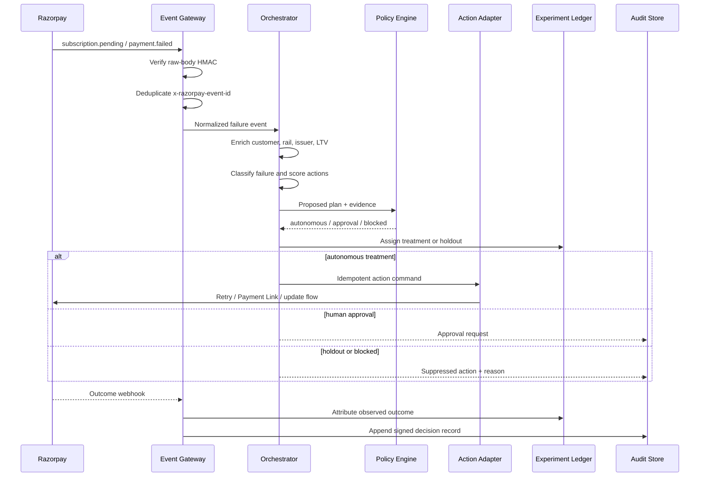

# Production architecture

## Design goal

Recover more recurring revenue while making every automated action safe, explainable, measurable and reversible.

## Event-to-action sequence



## Components

### 1. Event gateway

- accepts only Razorpay test/live webhook origins configured by the merchant;
- computes HMAC-SHA256 over the untouched request bytes;
- records `x-razorpay-event-id` before downstream processing;
- normalizes subscription, invoice, payment and error entities;
- tolerates duplicates and out-of-order delivery.

### 2. Recovery orchestrator

The orchestrator delegates to narrow agents instead of allowing one general model to act freely:

- **Failure classifier:** maps `source`, `step`, `reason`, subscription state and rail into a recovery taxonomy.
- **Recovery scorer:** predicts success probability and time-to-recovery for eligible actions.
- **Bank health sentinel:** suppresses attempts during issuer/network incidents.
- **Rail router:** chooses retry, method update, UPI re-mandate or Payment Link.
- **Message composer:** produces bounded, consent-aware copy from approved templates.
- **Trust guardian:** evaluates deterministic policies after model reasoning and before tools.

The language model can recommend. Only deterministic adapters execute.

### 3. Policy engine

Policies are versioned configuration, evaluated on every action:

```yaml
contact:
  maximum_per_72_hours: 2
  quiet_hours: "21:00-08:00 Asia/Kolkata"
  consent_required: true
money:
  human_approval_above_inr: 40000
upi_autopay:
  regular_industry_no_afa_limit_inr: 15000
execution:
  require_idempotency_key: true
  issuer_health_hold: true
```

The checked-in engine demonstrates these decisions in [`lib/recovery-engine.ts`](../lib/recovery-engine.ts).

### 4. Action adapters

- Razorpay subscription retry or hosted payment-method update
- Razorpay Payment Link creation and resend
- consent-aware message providers
- internal approval and customer-success escalation

Each adapter requires an idempotency key, a policy grant and a short-lived scoped credential. Agents never receive raw payment credentials.

### 5. Experiment ledger

Revive assigns eligible cases deterministically to treatment or holdout before action selection. Outcomes are joined by subscription/customer and measured after a fixed window. Guardrails include stable bucketing, minimum sample size, confidence intervals and no mid-flight winner switching.

This avoids the most common recovery analytics error: attributing every naturally recovered payment to the latest reminder or retry.

### 6. Audit store

Every record contains:

- event and decision IDs;
- normalized evidence;
- candidate actions and scores;
- chosen action and explanation;
- policy version and check results;
- model/tool versions;
- human approver when applicable;
- execution idempotency key;
- outcome event and timestamps;
- tamper-evident hash of the record.

## Data model

```text
Merchant
 ├─ PolicyVersion
 ├─ Playbook
 ├─ Experiment
 └─ Customer
     └─ Subscription
         ├─ RecoveryCase
         │   ├─ FailureEvent
         │   ├─ Decision
         │   ├─ Approval
         │   └─ ActionAttempt
         └─ OutcomeEvent
```

## Reliability strategy

- at-least-once input, effectively-once action execution;
- inbox table for source-event deduplication;
- transactional outbox for action commands;
- per-subscription state-machine lock;
- exponential backoff only for transport errors, never for hard declines;
- dead-letter queue with replay tooling;
- automatic pause on error-rate, complaint or issuer-health thresholds;
- shadow mode before any merchant enables autonomous actions.

## Security and privacy

- encryption in transit and at rest;
- tenant-scoped data and credentials;
- no PAN, CVV, UPI PIN or mandate credential storage;
- purpose-limited customer features;
- PII redaction in model prompts and logs;
- short retention for raw payloads, longer retention for normalized audit facts;
- role-based approvals and kill switch;
- data export/deletion workflow;
- secrets stored outside source control.

## Deployment path

The prototype is a Cloudflare Worker-compatible Vinext application. A production pilot would separate the event gateway, durable queues, relational decision store, model service, policy service and adapters. Start in Razorpay test mode, then shadow live events without actions, then graduate low-risk playbooks one at a time.
