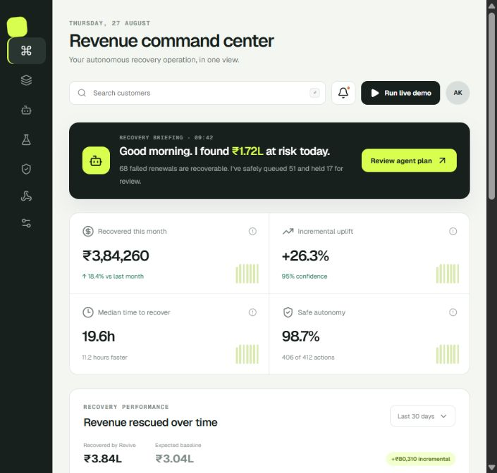
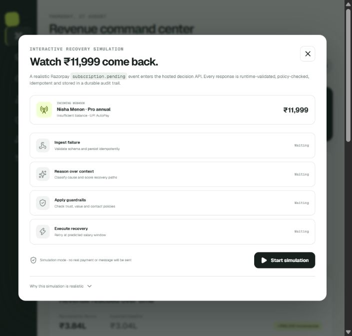
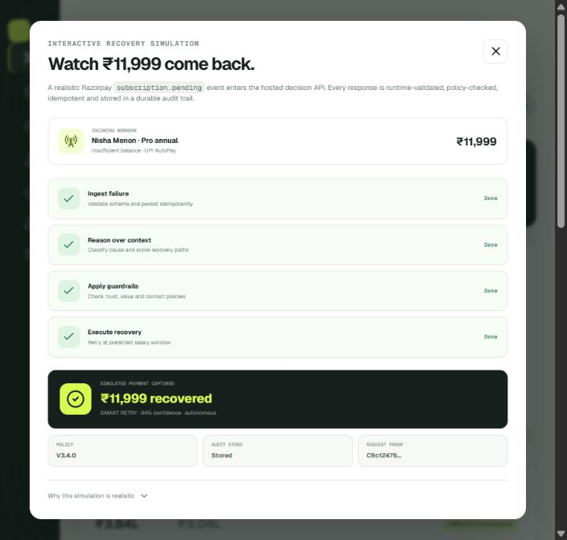

# Recruiter-flow product audit

Audit date: 27 August 2026  
Surface: https://revive-revenue.vercel.app  
Flow: command center → live recovery simulation → verified result

## Verdict

The product already has a distinctive fintech operations aesthetic, a clear money-at-risk story, and a truthful end-to-end simulation. Its biggest recruiter-facing weakness is proof discovery: the hosted backend, storage model, security boundary, and idempotency behavior are only visible after someone knows exactly where to click.

## Captured flow

### Step 1 — Command center

Health: strong visual hierarchy; proof visibility needs improvement.

- Strength: the recovery briefing, value metrics, and primary demo action establish the problem quickly.
- Issue: the strongest engineering differentiator is invisible. A recruiter can still misread the interface as a polished static dashboard.
- Issue: portfolio metrics are simulated but the visible command-center cards do not label that boundary.
- Accessibility: several icon-only sidebar controls do not expose useful accessible names in the captured DOM.

### Step 2 — Recovery simulation ready

Health: clear and credible.

- Strength: the modal explains the incoming event and separates validation, reasoning, policy, and execution.
- Issue: the scenario is fixed, so a technical reviewer cannot probe policy boundaries or change the recovery context.

### Step 3 — Recovery simulation verified

Health: excellent proof moment.

- Strength: the success state depends on a real API response and exposes policy version, persistence status, confidence, execution mode, and request proof.
- Issue: duplicate suppression is implemented but not demonstrated. The viewer must trust the copy instead of challenging the system.

## Highest-impact implementation changes

1. ✅ Added a first-class **System proof** surface with live health, backend host, deployment commit, persistence model, API boundaries, and recent immutable record counts.
2. ✅ Added a one-click **idempotency challenge** that sends the same event twice and visibly proves `stored → duplicate_suppressed`.
3. ✅ Added a configurable **Decision lab** so reviewers can change failure reason, payment rail, value, issuer health, consent, and contact pressure, then inspect the resulting policy trace.
4. ✅ Labeled simulated portfolio metrics at the dashboard level while keeping API/storage proof clearly live.
5. ✅ Gave every navigation control an accessible name and active-state semantics.

Implementation evidence: [`revive-system-proof-live.jpg`](assets/revive-system-proof-live.jpg) and [`revive-live-challenge.jpg`](assets/revive-live-challenge.jpg).

## Evidence limits

Screenshots confirm visual hierarchy, visible copy, DOM names, and the successful core flow. They do not establish full WCAG compliance, screen-reader behavior, focus trapping, production load capacity, or real Razorpay execution.
